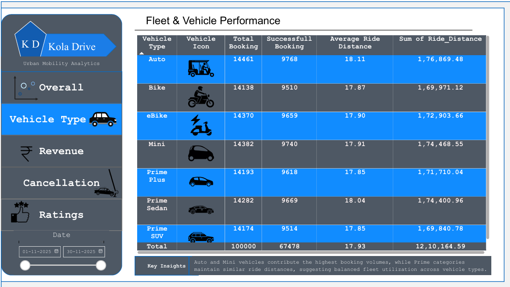
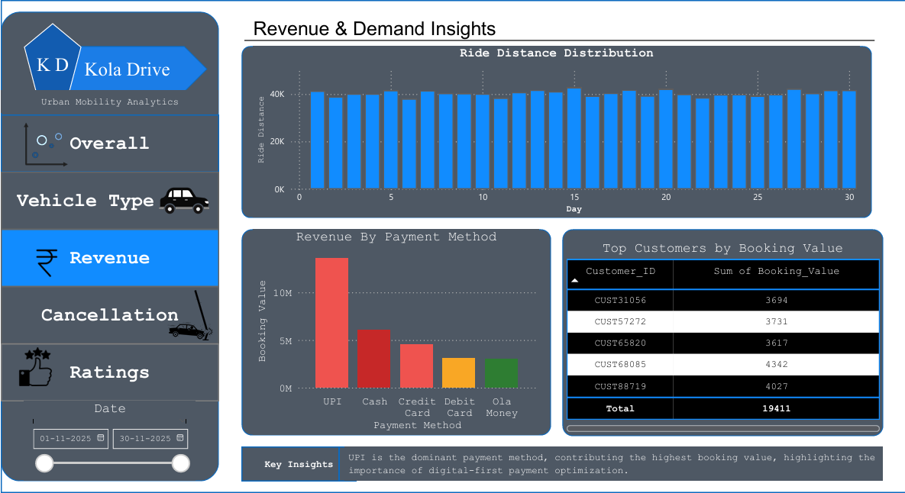
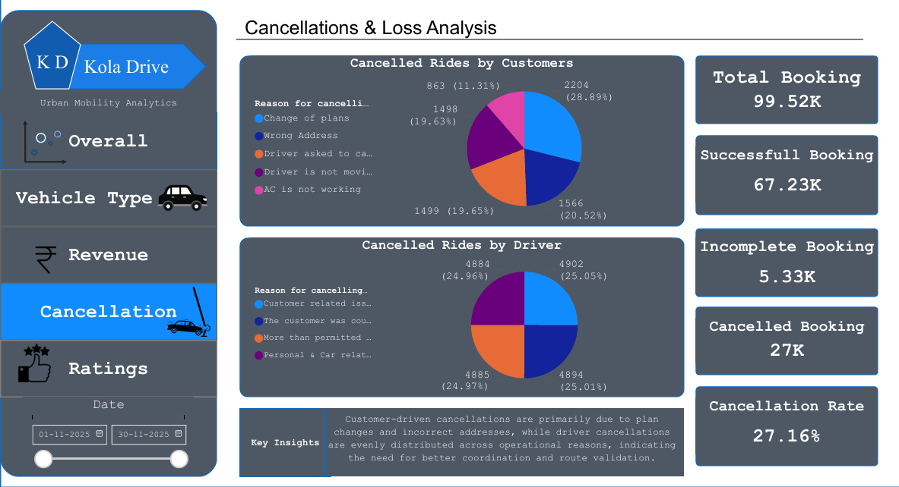
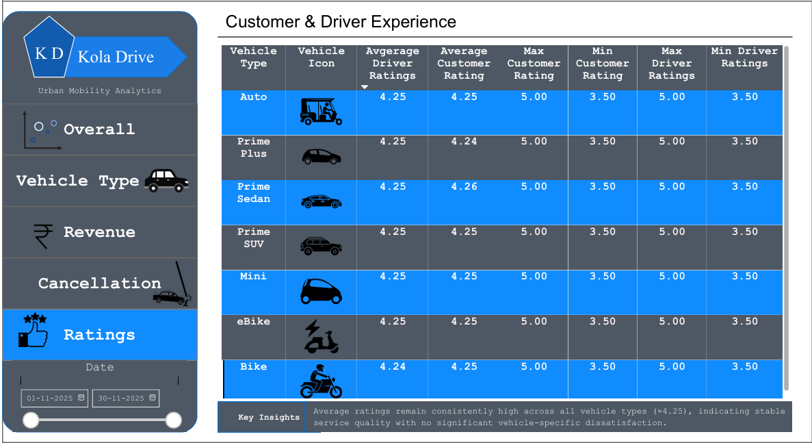

# 🚕 Urban Mobility Analytics – End-to-End Ride Booking Intelligence (Power BI)

## 📌 Project Overview
This project presents an **end-to-end urban mobility analytics solution** built using **Power BI**, focused on analyzing ride-booking data to uncover demand patterns, operational efficiency, revenue drivers, cancellations, and customer & driver experience.

The dashboard simulates a real-world ride-hailing platform (similar to Ola/Uber) and demonstrates how data-driven insights support operational and business decisions.

---

## 🎯 Objectives
- Analyze overall booking performance and platform activity  
- Identify demand trends and revenue patterns  
- Understand cancellation behavior and operational loss  
- Evaluate fleet performance across vehicle types  
- Assess customer and driver experience using ratings  

---

## 🗂 Dataset Overview
The dataset contains ride-booking records with the following attributes:
- Booking ID, Date, Time  
- Booking Status (Successful, Cancelled, Incomplete)  
- Vehicle Type  
- Ride Distance  
- Booking Value  
- Payment Method  
- Cancellation Reasons (Customer & Driver)  
- Customer Ratings & Driver Ratings  

---

## 📊 Dashboard Preview

### 🔹 Overall Performance Overview

**Key Insight:**  
The platform processed **99.52K bookings** with a stable daily demand pattern. However, only **67.48%** of bookings were successfully completed, indicating that nearly one-third of demand is lost due to cancellations or incomplete rides.

---

### 🔹 Fleet & Vehicle Performance

**Insight:**  
Auto and Mini vehicles contribute the highest booking volumes, while Prime categories show consistent ride distances, indicating balanced fleet utilization.

---

### 🔹 Revenue & Demand Insights

**Insight:**  
Digital payment methods—especially UPI—dominate booking value, highlighting strong adoption of cashless transactions.

---

### 🔹 Cancellations & Loss Analysis

**Insight:**  
Customer cancellations are largely driven by plan changes and address issues, while driver cancellations are evenly spread across operational reasons—pointing to coordination and routing inefficiencies.

---

<<<<<<< HEAD
### 🔹 Customer & Driver Experience

=======
> How to Use
>
> • Download the .pbix file from this repository
>
> • Open using Power BI Desktop
>
> • Explore dashboards using slicers and filters
>

**👤 Author**
>>>>>>> 804cd42afc3a690ad502551299380a2bb4d4ce73

**Insight:**  
Average ratings remain consistently high across vehicle types (≈4.2+), indicating stable service quality with no major vehicle-specific dissatisfaction.

<<<<<<< HEAD
---

## 🧮 Key KPIs
- Total Bookings  
- Successful Bookings  
- Cancelled Bookings  
- Cancellation Rate (%)  
- Average Ride Distance  
- Revenue by Payment Method  

All KPIs are validated to ensure:
> **Total Bookings = Successful Bookings + Cancelled Bookings**

---

## 🛠 Tools & Technologies
- **Power BI Desktop**  
- **DAX (Data Analysis Expressions)**  
- **Data Modeling & Visualization**  
- **Business Analytics & Storytelling**

---

## 📈 Business Value
This project demonstrates how analytics can:
- Reduce revenue leakage from cancellations  
- Improve fleet utilization  
- Enhance customer and driver satisfaction  
- Support data-driven operational decisions  

---

## ▶️ How to Use
1. Download the `.pbix` file from this repository  
2. Open it using **Power BI Desktop**  
3. Use slicers (date, vehicle type) to explore insights  

---

## 👤 Author
**Kedar Raju Pawar**  
**Data Analyst | Power BI | Data Analytics**

---

## 📄 License
This project is released under the **MIT License**.
=======
**Data** **Analyst** **\|** **Power** **BI** **\|** **Data**
**Analytics**

>>>>>>> 804cd42afc3a690ad502551299380a2bb4d4ce73
