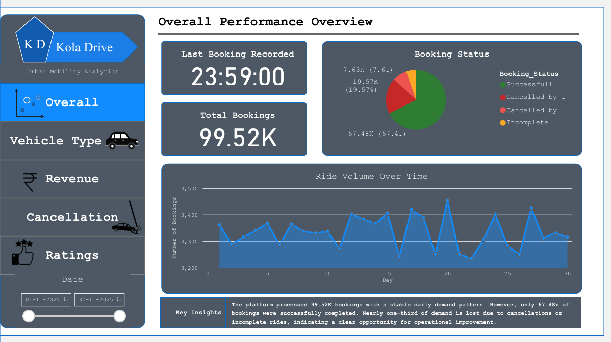
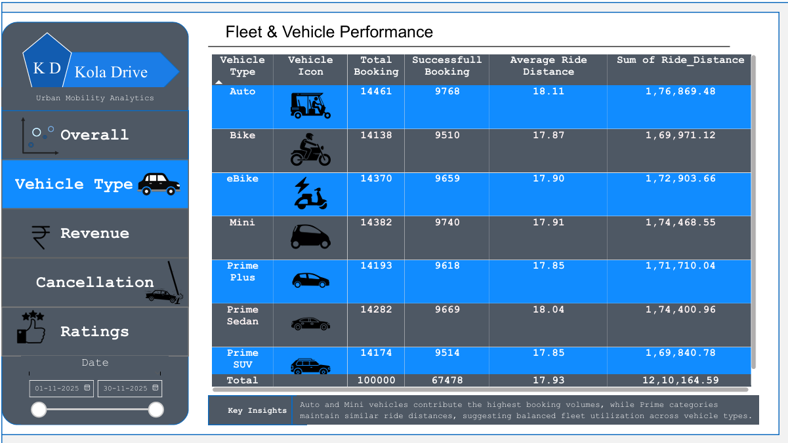
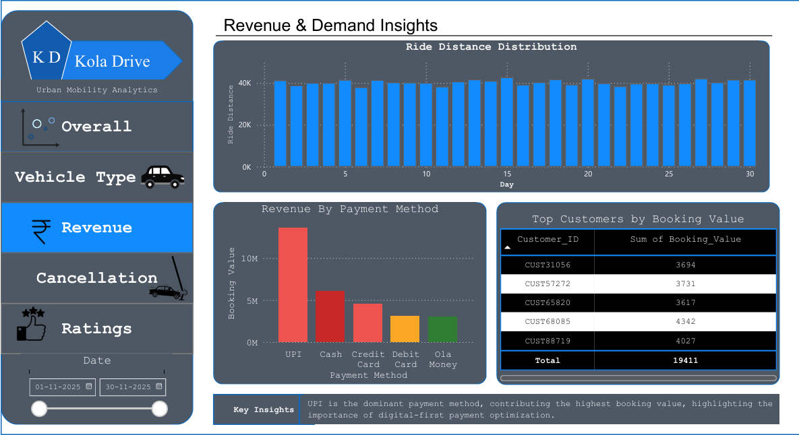
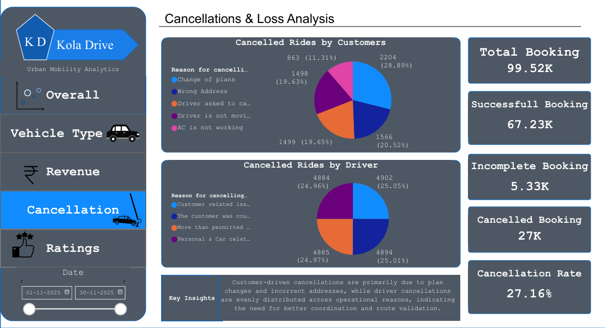
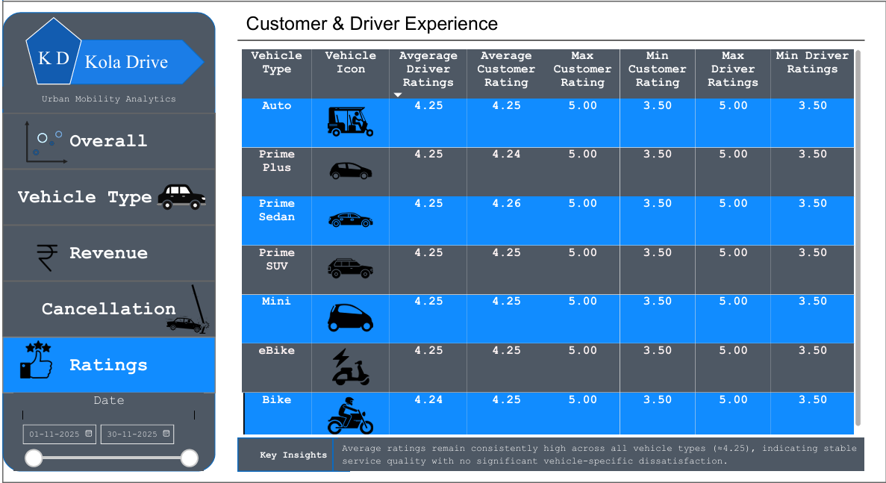

# 🚕 Urban Mobility Analytics — End-to-End Ride Booking Intelligence

An end-to-end **Data Analytics case study** that simulates a real-world ride-hailing platform (like Ola/Uber) and transforms raw booking data into business insights using **Python, MySQL, SQL, and Power BI**.

This project demonstrates the full analytics workflow — from **synthetic data generation → database modeling → SQL analysis → KPI design → interactive dashboarding → business insight extraction**.

---

# 📌 Problem Statement

Ride-booking platforms generate large volumes of operational data. Without structured analytics, it is difficult to clearly identify:

- Revenue leakage  
- Cancellation drivers  
- Demand patterns  
- Fleet utilization gaps  
- Service quality trends  

This project builds a complete analytics pipeline to answer those questions using realistic simulated data.

---

# 🎯 Objectives

- 📈 Measure overall booking & revenue performance  
- 🚗 Compare fleet utilization across vehicle types  
- ❌ Analyze cancellation & incomplete ride patterns  
- 💳 Study payment method contribution  
- ⭐ Evaluate customer & driver ratings  
- 🧠 Convert operational data into decision-ready KPIs  

---

# 🗂 Dataset Overview

Synthetic ride-booking dataset generated using Python to simulate realistic platform behavior.

**Scale:** ~100,000 bookings  
**Domain:** Urban Mobility Analytics  

## Attributes Included

- Booking ID, Date, Time  
- Booking Status (Successful, Cancelled, Incomplete)  
- Vehicle Type  
- Pickup & Drop Locations  
- Ride Distance  
- Booking Value  
- Payment Method  
- Customer & Driver Ratings  
- Customer Cancellation Reasons  
- Driver Cancellation Reasons  

---

# ⚙️ End-to-End Analytics Pipeline
Python Data Generator
↓
CSV Export
↓
MySQL Database
↓
SQL Analysis
↓
KPI Design
↓
Power BI Dashboard
↓
Business Insights

---

# 🧮 Key KPIs Designed

- Total Bookings  
- Successful Bookings  
- Cancelled Bookings  
- Cancellation Rate (%)  
- Total Revenue  
- Revenue by Payment Method  
- Avg Ride Distance  
- Avg Customer Rating  
- Avg Driver Rating  

**Validation Rule:**
Total Bookings = Successful + Cancelled + Incomplete

---

# 📊 Dashboard Preview

## 🔹 Overall Performance Overview

**Insight:**  
~99.5K bookings processed with stable daily demand. Only ~67% completed successfully — indicating significant operational leakage.

---

## 🔹 Fleet & Vehicle Performance

**Insight:**  
Auto & Mini lead booking volume. Prime categories show consistent ride distances — indicating balanced fleet usage.

---

## 🔹 Revenue & Demand Insights

**Insight:**  
UPI dominates booking value — showing strong digital payment adoption.

---

## 🔹 Cancellations & Loss Analysis

**Insight:**  
Customer cancellations are driven by plan/address issues. Driver cancellations are spread across operational causes — suggesting coordination inefficiencies.

---

## 🔹 Customer & Driver Experience

**Insight:**  
Ratings remain stable across vehicle types (~4.2+) — indicating consistent service quality.

---

# 🛠 Tools & Technologies

| Area | Tools |
|------|--------|
Data Generation | Python, Pandas |
Database | MySQL |
Querying | SQL |
Analytics | KPI Design |
Visualization | Power BI Desktop |
Modeling | DAX |
Version Control | Git, GitHub |

---

# 🧪 Analytical Work Performed (SQL Layer)

- Booking success rate analysis  
- Revenue aggregation  
- Payment behavior analysis  
- Vehicle performance comparison  
- Cancellation reason distribution  
- Weekend vs weekday revenue comparison  
- Repeat cancellation customer detection  
- Rating analysis by vehicle type  

---

# 📁 Repository Structure
analysis/ → SQL & Python analytics scripts
data_generation/ → Synthetic dataset generator
visualization/ → Power BI dashboard file
screenshots/ → Dashboard previews
README.md

---

# ▶️ How to Use

1. Download the `.pbix` dashboard file  
2. Open in **Power BI Desktop**  
3. Use slicers (date, vehicle type, payment method)  
4. Explore KPIs and drill-down visuals  

---

# 📈 Business Value

This analytics solution can help a mobility platform:

- Reduce revenue leakage from cancellations  
- Improve fleet allocation strategy  
- Optimize digital payment incentives  
- Monitor service quality  
- Detect behavioral risk patterns  
- Support data-driven operational decisions  

---

# 👤 Author

**Kedar Raju Pawar**  
Data Analyst | SQL | Python | Power BI  

---

# 📄 License

This project is released under the **MIT License**.
